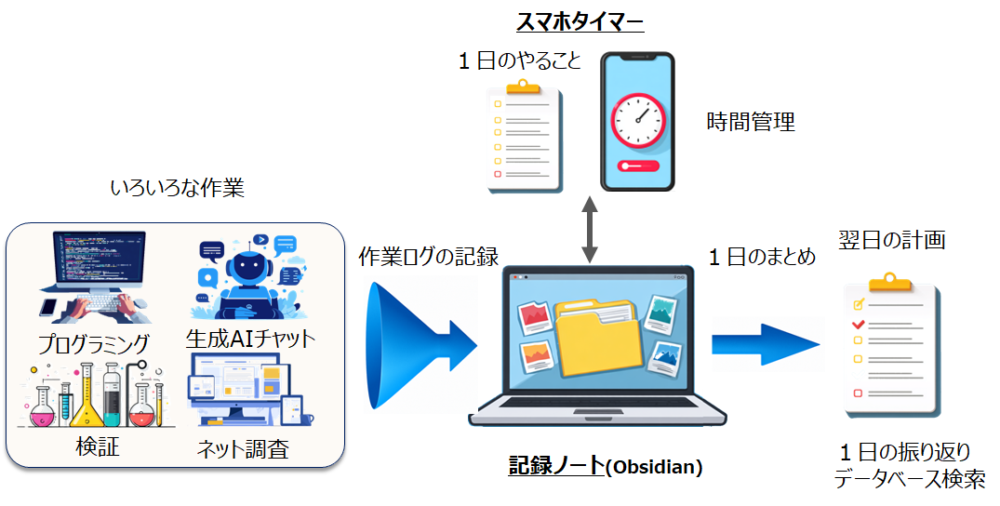

# ptune Project

## Overview

**ptune** is a personal work-log management system that integrates  
**task management on mobile** with **work journaling and analysis in Obsidian**,  
helping you naturally reflect on your daily activities.

The system consists of the following **two main components**:

### 1. Mobile App: **ptune**
- Check today's tasks (ToDo list)
- Work with a Pomodoro-style focus timer
- Automatically record work sessions, start/end times, and completion status
- Sync tasks and progress with your PC via Google Tasks

### 2. Obsidian Plugin: **ptune-log**
- Create and accumulate work journals in Obsidian
- Aggregate and organize work logs
- Extract key points and keywords using AI
- Automatically summarize the day in Daily Notes and prepare for the next day

On Windows, you can also use **PtuneSync**,  
a helper tool that simplifies Google authentication and synchronization.

---

## System Overview

The ptune project is designed to support the full workflow:

**“Work on mobile → Store in Obsidian → Reflect with AI.”**

- Various activities (programming, AI chat, research, experiments, etc.)  
- → Logs are accumulated in Obsidian  
- → Time management with the mobile app  
- → Leads to daily reflection and next-day planning

---

## Data Flow (Technical Overview)

The following diagram shows  
**how the mobile timer app and Obsidian integrate via Google Tasks**.

---

## Daily Workflow (Use Cases)

### Morning: Organize tasks in Obsidian
- Write down what you plan to do today  
- Sync tasks to Google Tasks  
- The updated tasks appear on your mobile device  

### Afternoon: Record your work on mobile and in Obsidian
- Accumulate various work logs in your Obsidian notes according to each task  
- Simply start/stop the timer to automatically record work duration  
- Work details and completion status are stored in Google Tasks  

### Evening: Review in Obsidian
- The day’s work logs are automatically aggregated  
- AI extracts key points and keywords  
- “What went well today (Keep)” is saved to the Daily Note  
- Helps you plan for the next day  

---

## Benefits of the ptune Project

- **Automatic aggregation of work logs**  
- **Easy note creation and organization (AI summaries + keyword extraction)**  
- **Seamless integration between mobile and desktop**  
- **Daily reflection becomes a natural habit**  
- **Improves the quality of next-day planning**

---

## Related Links

- 📱 **Mobile App: ptune**  
   [GitHub — getperf/ptune](https://github.com/getperf/ptune)

- 📒 **Obsidian Plugin: ptune-log**  
   [GitHub — getperf/ptune-log](https://github.com/getperf/ptune-log)

- 💻 **PtuneSync (Windows Sync Tool)**  
   [GitHub — getperf/PtuneSync](https://github.com/getperf/PtuneSync)

- ⚖️ [**Privacy Policy**](privacy.md)  

---

© 2025 getperf.net
