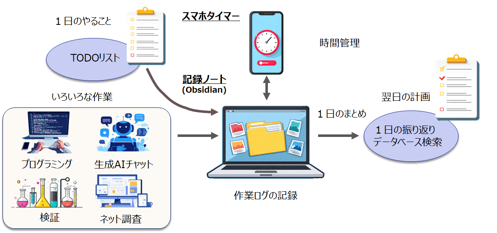
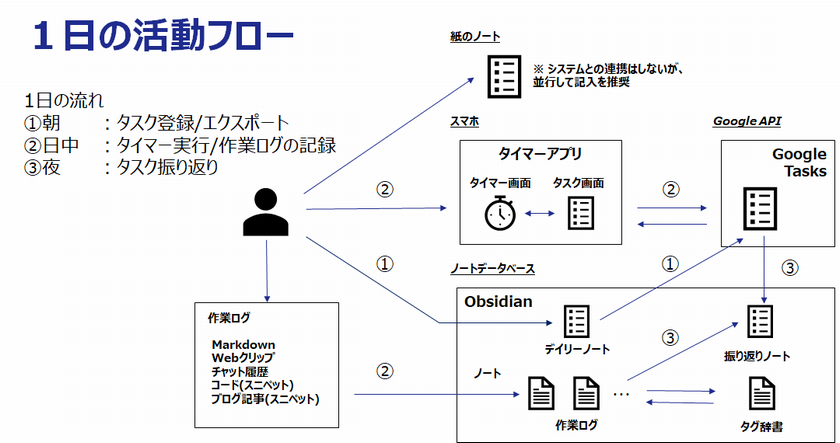

## ptune プロジェクト

## 概要

**1日を回すためのタスクと記録の仕組み**

ptune プロジェクトは、  
1日単位で「計画・実行・振り返り」を回すための個人向けワークログ基盤です。

朝に計画を立て、  
日中に作業を進め、  
夜に自分で振り返る。  

ptune は、この日々の流れを無理なく継続できるよう支援するツールです。

---

## 1日の流れ

ptune は「1日を回す」ことに特化したシンプルな仕組みです。

スマホと Obsidian は、必要に応じて Google Tasks を介して連携します。

### 朝：計画する
- 今日やることを整理する  
- タスクを決める  
- 必要に応じて同期する  

### 日中：実行する
- 作業を進める  
- タイマーで時間を記録する  
- 必要に応じてメモを残す  

### 夜：振り返る
- 1日の実績を確認する  
- 作業内容を見返す  
- 改善点を整理する  
- 必要に応じてAIで要点整理（※任意）  

※ AI の利用はオプションです。  
※ AI を利用しなくても振り返りは可能です。  

---

## 特徴

- 1日単位で運用を回す設計  
- 計画・実行・振り返りを一体化  
- 振り返りはユーザ主体で行い、AI はその補助として利用可能 
- タスク管理と記録分析の役割分離  

---

## プロジェクト構成

本プロジェクトは、毎日の運用に必要な基本機能 **ptune-task** と、  
より高度な記録活用を行う応用機能 **ptune-log** で構成されます。

### ptune-task

**ptune-task** は、ptune プロジェクトの基本機能です。  
**1日の計画・実行・振り返りを安定して回すための中心となるタスク管理ツール**です。

- タスクの整理と実行管理  
- スマホタイマーによる作業時間の記録  
- Google Tasks を使った同期  

#### 特徴

- 日次運用に特化したシンプルな構成  
- 安定した運用を重視  
- AI はオプション扱いで、使わなくても完結可能  
- ptune を使い始める上での基本機能  

---

### ptune-log

**ptune-log** は、作業記録をより深く活用したい利用者向けの応用機能です。  
**日々の運用に必須ではなく、より高度な整理・分析を行いたい場合に利用する拡張的な仕組み**です。

- 作業ノートの整理  
- 記録の構造化  
- 振り返りの材料整理  

#### 特徴

- より高度な記録活用を想定  
- 機能や構成は現在検討中  
- 将来的な拡張を前提とした設計  
- エキスパート寄りの利用を想定  

※ AI 活用も含めて検討中です。 

---

## ptune-task / ptune-log 比較

| 構成 | ptune-task | ptune-log |
|------|------------|-----------|
| 位置づけ | 基本機能 | 応用機能 |
| 必須性 | 必須 | 任意 |
| ユースケース | 日々のタスク管理 | 作業記録の整理・分析 |
| 対象 | 日次運用を安定して回したいユーザ | より高度な記録・分析を行いたいユーザ |
| 扱うデータ | タスク、実績、基本的な作業記録 | ノート、メモ、ログなど多様な記録 |
| 目的 | タスク遂行、生産性向上 | 知識の構造化 |
| プラットフォーム | Obsidian + スマホタイマー(ptune) | Obsidian + Python |
| AI利用 | 任意（要約など限定用途） | 積極的に活用 |
| 開発方針 | 安定運用重視 | 段階的検討・拡張 |

---

## 関連リンク

- **ptune（スマホアプリ）**  
  https://github.com/getperf/ptune  

- **ptune-task（Obsidian プラグイン）**  
  https://github.com/getperf/ptune-task  

- **ptune-log（Python パッケージ）**  
  https://github.com/getperf/ptune-log  

- **PtuneSync（Windows 補助ツール）**  
  https://github.com/getperf/PtuneSync  

- [プライバシーポリシー](privacy.md)

---

© 2025-2026 getperf.net