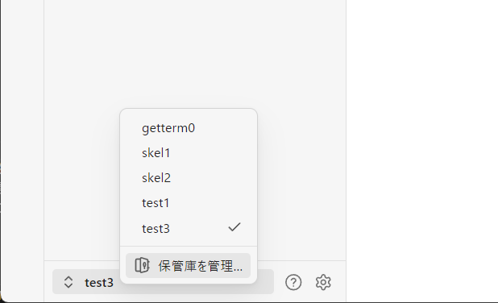

## Obsidian インストール

ここでは、Windows と macOS に Obsidian をインストールする方法を説明します。

---

## Windows 環境のインストール

1. [公式サイト](https://obsidian.md/download) にアクセス
2. Windows Installer (64bit) をダウンロード
3. ダウンロードした `Obsidian-Setup.exe` を実行
4. 画面の指示に従ってインストール
5. 初回起動後、Vault（ノート保存フォルダ）を作成または既存フォルダを指定

### 補足：Windows のインストール場所

通常、以下のディレクトリにインストールされます。

```
C:\Users<ユーザー名>\AppData\Local\Programs\Obsidian
```

---

## macOS 環境のインストール

1. [公式サイト](https://obsidian.md/download) にアクセス
2. macOS 用の dmg ファイルをダウンロード
3. ダウンロードした `Obsidian.dmg` を開く
4. Obsidian アイコンを Applications フォルダへドラッグ＆ドロップ
5. Launchpad または Finder から Obsidian を起動
6. 初回起動後、Vault を作成または既存フォルダを指定

---

## Vault の作成と指定

Obsidian では、ノートは **Vault（ボルト）** と呼ばれるフォルダに保存されます。  
以降の ptune-log の利用では、この Vault がノート保存場所となります。

---

### 新しい Vault を作成する

1. Obsidian 起動後の「Vault を開く」画面で **新しい Vault を作成** を選択
2. Vault の名前を入力  
   - 推奨：ローマ字英数字（例：`MyVault`）
3. 保存先フォルダを指定  
   - Windows 例: `C:\Users\<ユーザー名>\Documents`  
   - macOS 例: `/Users/<ユーザー名>/Documents`

### 既存フォルダを Vault に指定する

1. 「既存のフォルダを Vault として開く」を選択
2. 任意のフォルダを選択すると、その中の Markdown がノートとして扱われます

### 補足：Vault の実体

Vault の実体は通常のフォルダです。  
このフォルダ直下にある Markdown ファイルが Obsidian ノートになります。

---

## 動作確認

- Obsidian が起動し、Vault の作成または指定ができること
- Vault 内で新しいノートを作成して保存できること
- 以降の手順でコミュニティプラグインを導入できること

### 補足：Vault の管理画面

Vault を変更する場合は、画面下のメニューから保管庫の管理を開きます。



---

## コミュニティプラグイン有効化

ptune-log を導入するには、Obsidian の設定で  
**コミュニティプラグイン** を有効化する必要があります。

---

### 手順

1. Obsidian を起動し、左下の **設定（歯車アイコン）** を開く
2. **General > Language** で **日本語** を選択
3. **設定 > コミュニティプラグイン** を開く
4. 「コミュニティプラグインを有効化」をクリック  
   → 「制限モード」を **オフ** に切り替える
5. 警告が表示されたら内容を確認して同意

### 補足：コミュニティプラグインの注意

- **セキュリティ**  
  コミュニティプラグインは公式サポート外のため、自己責任で利用する必要があります。
- **環境差異**  
  Windows / macOS で画面の見た目が多少異なることがあります。

