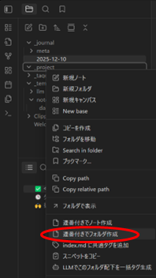
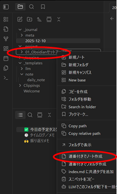

## 昼：作業開始：タイマーを開始し、作業ノートを準備する

このステップでは、ptune タイマーを開始し、  
今日の作業ログを記録するための **プロジェクトフォルダと作業ノート** を作成します。

## ノートの構成ルール（基本）

作業ノートは _project/ 配下のフォルダに蓄積されます。

- ノートは「連番 + タイトル」で作成  
- 1階層目はプロジェクトフォルダーを作成し、その下にノートを作成
- フォルダーは1階層のみ  
- 作業ログは「追加していく」形式で蓄積  

---

## 1. ptune でタイマーを開始する

ホーム画面から対象タスクを選択し、**「開始」ボタン**をタップします。

タイマーが動作を開始し、作業セッションがスタートします。

---

## 2. プロジェクトフォルダを作成する（Obsidian）

`_project/` フォルダを右クリックし、  
**「連番付きでフォルダ作成」** を実行します。

ダイアログでは次を入力します：

- **タスクを選択**（任意／選択するとタイトル自動入力）
- **タイトルを入力**（タスク名とは別名でも可）

「作成」を押すと、新しいプロジェクトフォルダが生成されます。

---

## 3. 作業ノートを作成する（Obsidian）

作成したフォルダを右クリックし、  
**「連番付きでノート作成」** を選択します。

ダイアログでは：

- タスク選択（任意）
- タイトル入力（自動 / 編集可）
- **作業の目標を入力（任意）**
- **目標カテゴリを選択するとテンプレートが挿入**

「作成」を押すと、新しい作業ノートが生成されます。

---

## 4. 作業ノートの準備が完了

生成されたノートには、Step3 で作業ログ（ChatGPT など）を記録していきます。

