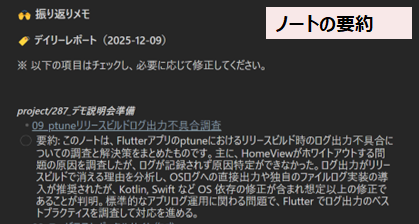
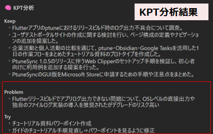

## ⑤ 夜：振り返り（タスク・ノートの 1 日総括）

夜は、その日のタスク進捗と作業ノートをまとめる **振り返りの時間**です。  
ptune・Obsidian を連携させることで、タスク実績とノート要約を自動で取り込み、  
次の日の計画につなげることができます。

---

# 1. ptune → Google Tasks の同期を行う

作業を終えたら、まず ptune 側でその日のタスク実績を Google Tasks に反映します。

### 手順

1. ptune の **同期メニュー**を開く  
2. **「Google Tasks にタスクを反映」** を実行  

これにより、ポモドーロ実績・完了ステータス・作業時間などが Google Tasks に反映されます。

---

# 2. タスク進捗を Obsidian デイリーノートへ取り込む  
Google Tasks のデータを Obsidian デイリーノートに出力します。

### 手順

1. Obsidian の **コマンドパレット** を開く（Ctrl + P）  
2. **「タスクの振り返りレポート」** を実行  
3. デイリーノートに、その日の **タスク実績レポート** が挿入されます  

---

# 3. ノートの振り返りを実行する（LLM 要約・KPT）

続いて、その日の作業ノートを振り返ります。  
AI（LLM）により、要約・KPT の整理を自動化できます。

### 手順

1. Obsidian のコマンドパレットを開く（Ctrl + P）  
2. **「今日の振り返り」** を実行  
3. 日付を選択  
4. デイリーノートに以下の内容が生成されます：  
    - ノートの要約  
    - KPT（Keep / Problem / Try）  
    - タグ一覧  

（スクリーンショット：ノートの要約）  

  

---

## KPT（Keep / Problem / Try）についての注意点

AI による KPT は誤回答になりやすいため、  
**安全のため「Keep のみ」AI が生成します。**

- **Keep：** AI が要点を抽出して記述  
- **Problem：** ユーザーが手書きで記入  
- **Try：** ユーザーが手書きで記入し、翌日のタスク計画につなげる  

（スクリーンショット：KPT）  
  

---

# 4. 明日へのつなげ方（重要）

夜の振り返りで生成された内容は、翌日の計画に直結します。

- タスク振り返りを確認して **未完了タスクを翌日に繰り越す**  
- 要約・Keep を読み返し、**何を継続すべきか整理**  
- Problem / Try を手書きで記入し、**翌日のタスクを明確化**  
- 次の朝、Step1（タスク定義）に戻ると自然に流れがつながる  

---

## 5. 次のステップへ

翌日は、「① 朝：タスク定義」からスタートします。

日々このサイクルを繰り返すことで、  
作業ログが蓄積され、振り返りの質も大幅に向上していきます。
