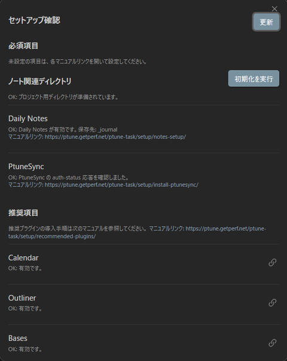

## ptune-task プラグインインストール

このページでは、Obsidian に **ptune-task** を導入し、最初に **セットアップ確認モーダル** を開くところまでを説明します。

詳細な設定は、モーダルに表示される項目ごとに別ページで説明します。

## 1. BRAT をインストールする

BRAT は、コミュニティプラグインとして未公開またはベータ版のプラグインを GitHub リポジトリから導入するための Obsidian プラグインです。

1. Obsidian の **設定 > コミュニティプラグイン** を開く
2. **閲覧** をクリック
3. 検索バーに `BRAT` と入力
4. **Obsidian42 - BRAT** をインストール
5. インストール後に **有効化** する
6. 有効化を確認したら、設定画面を閉じる

## 2. BRAT 経由で ptune-task を追加する

1. `Ctrl + P` でコマンドパレットを開く
2. `Add a Beta plugin` を検索して実行
3. GitHub リポジトリとして `getperf/ptune-task` を入力
4. **Select a version** で `Latest` を選択
5. **Add plugin** をクリック
6. インストール完了後、**設定 > コミュニティプラグイン** を開く
7. 一覧に `ptune-task` が表示されていることを確認
8. `ptune-task` を有効化する

## 3. セットアップ確認モーダルを開く

ptune-task では、初回利用時に **セットアップ確認** モーダルから必要な項目を順に確認します。

1. `Ctrl + P` でコマンドパレットを開く
2. `ptune` で検索し、**セットアップ確認** を選択する
3. 添付イメージのようなモーダルが表示されることを確認する

## 4. モーダルの見方

モーダルには、主に次の項目が表示されます。

- **必須項目**
  `_project` と `_journal` のフォルダ初期化、`Daily Notes` と `PtuneSync` のような、利用開始に必要な項目を確認します
- **推奨項目**
  `Calendar`、`Outliner`、`Bases` などの推奨プラグインを確認します

まずは **初期化を実行** を押し、その後で各項目の詳細ページに進んでください。

## 5. 詳細手順

- [ノート関連ディレクトリの初期化と Daily Notes 設定](notes-setup.md)
- [PtuneSync セットアップ](install-ptunesync.md)
- [推奨項目の各種プラグイン設定](recommended-plugins.md)

