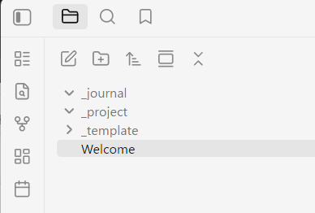

## ノート関連ディレクトリの初期化と Daily Notes 設定

このページでは、セットアップ確認モーダルの **ノート関連ディレクトリ** と **Daily Notes** の設定を説明します。

## 1. 初期化を実行する

セットアップ確認モーダルの **初期化を実行** をクリックします。

この操作で、Vault 配下に次のフォルダが作成されます。

- `_project` ： 作業ノート保存
- `_journal` ： デイリーノート保存
- `_template` ： テンプレート保存

### 確認ポイント

Obsidianのファイルエクスプローラで以下フォルダが作成されていることを確認します。

## 2. Daily Notes を有効化する

次に、Obsidian のコアプラグイン **Daily Notes** を有効化します。

1. Obsidian の **設定** を開く
2. **コアプラグイン** を開く
3. **Daily Notes** を有効化する

## 3. Daily Notes の保存先を設定する

1. **設定** > **コアプラグインメニュー**の下の、 **デイリーノート** を開く
2. **新規ファイルの場所** を `_journal` に設定

日付の書式、テンプレートファイルは任意で構いません。  
テンプレートファイルを使う場合は、ptune-task の運用方針に合わせて、`_template` の下に作成したテンプレートを設定してください。

## 4. セットアップ確認モーダルに戻って再確認する

設定後、Ctrl-P で、 **セットアップ確認** モーダルを開きます。

- `Daily Notes` が未設定から解消されている
- ノート関連ディレクトリの状態が OK になっている

