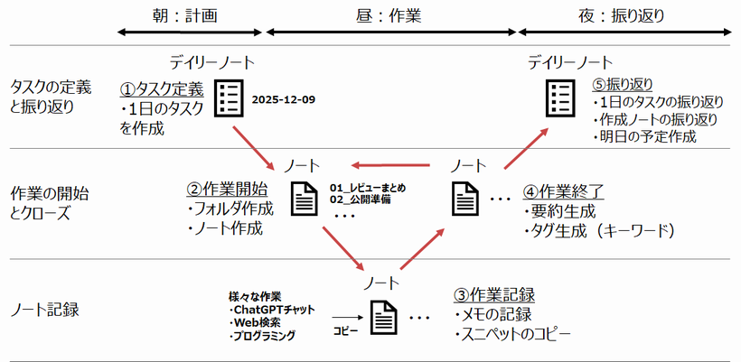

## 1日の流れ（全体像）

ptune-task では、Obsidian とスマホアプリ ptune を組み合わせて、1日の作業を次の流れで進めます。

## 5つのステップ概要

- **① 朝: タスク定義**  
  デイリーノートに今日の予定タスクを書き、Google Tasks と ptune に同期します。

- **② 昼: 作業開始**  
  実行するタスクを選び、必要なノートを開いて作業を始めます。

- **③ 日中: ノート記録**  
  作業メモ、判断理由、AI ツールの要点などをノートに残します。

- **④ 作業終了**  
  その時点のノートを整理し、次の作業に進みやすい状態にします。

- **⑤ 夜: 振り返り**  
  `ptune-task: 今日の振り返り` を実行し、出力されたレポートをもとにユーザ自身が振り返ります。

## 夜の振り返りで行うこと

- タスク実績を確認する
- 記録ノートの要約を確認する
- 振り返りポイントを自分で編集する
- 明日の Todo を追加する

AI を使う場合も、要約や整理の補助に留めます。  
良かった点、悪かった点、明日の行動はユーザ自身が判断してください。
