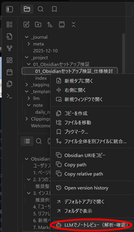
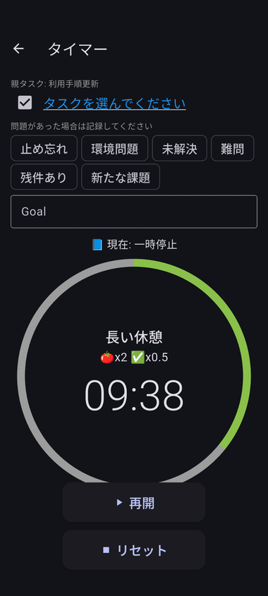
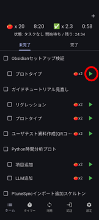

## ④ 作業終了：ノートレビューと次の作業へ

このステップでは、  
作業ノートのレビューを実施し、次の作業へスムーズに移行する方法を説明します。

---

## 1. LLM によるノートレビューを実施する

Step3 で作成したノートを開き、  
**ノートレビュー（要約・問題点整理・キーワード抽出）** を実行します。

### 実行手順

1. 対象ノートを選択  
2. 右クリック → **「LLM でノートレビュー」** を選択  
3. レビュー画面が表示される  
4. **LLMタグ生成** をクリックして実行

### レビュー画面で行う操作

- **自動生成されたサマリの確認**
    - 必要に応じてサマリ文を編集  
- **タグ（キーワード候補）の調整**
    - タグ候補の再選択、 ON/OFF 切り替えによるタグ登録可否の調整

### 保存について

「保存」を押すと、レビュー内容はノートの **YAML フロントマターに反映** されます。

---

## 2. ptune タイマーを終了する

作業が完了したら、スマホアプリ **ptune** に戻って  
タイマー（作業セッション）を終了します。

### 手順

1. タイマー画面右上の **チェックボックス** をタップ  

2. セッションが終了し、「タスクを選んでください」をクリックしてホーム画面へ戻ります  

3. 必要に応じて次のタスクを選択し、タイマーを再開できます  

---

## 3. 次の作業を開始する

次の作業に進む際は、状況に応じて次のいずれかを行います。

### ① 新しい作業を開始する場合

- Step2 と同じ手順で **新しいプロジェクトフォルダを作成**

### ② 親タスクが同じで別の作業をする場合

- Step2 と同じ手順で **新しい作業ノートを作成し、記録を開始**

### ③ 同じ作業の継続の場合

- 既存フォルダ内のノートに追記して記録を続ける  
- ChatGPT やメモなどを追加し、ログを蓄積する

作業内容に応じて、**フォルダを分ける／同じノートに追記する** を使い分けます。

---

## 次のステップへ

次は、この日記録したログをもとに  
**1日の振り返り（タスク実績／KPT）** を行います。
