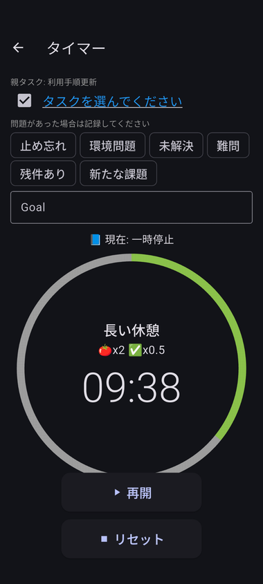

## ④ 作業終了: ノートを整理する

このステップでは、作業が一区切りしたときに **ノートを軽く整理して次の作業へつなげる方法** を説明します。

## 1. ノートの内容を整理する

対象の作業ノートを開いて、次を確認します。

- 途中メモが残りすぎていないか
- 採用した方針、次にやることなど決定事項が書かれているか

必要なら、要点だけが残るように追記や整形を行います。

## 2. ノート要約を作る

ノート要約は、夜の振り返り前に論点を整理するための補助です。  
AI を使う場合も、使わない場合も、同じ `ノート要約` の画面で内容を整えて保存できます。

- 対象ノートをファイルエクスプローラで選択し、右クリックします
- `ノート要約` を実行して、ノート要約の画面を開きます
- もしくは、Ctrl-P でコマンドパレットを開き、**`ptune-task : ノート要約を生成`** を実行します
- AI を利用する場合は、そのノート本文をもとに要約が生成されます
- AI を使わない場合も、同じ画面で要点を手動で記述できます
- 要約はそのまま採用せず、内容を確認して必要なら修正してください
- 要約は夜の振り返り前に論点を整理したいときの補助として使えます

## 3. ptune でタスクのミニレビューを残す

1. スマホアプリ ptune に戻る
2. 今の作業セッションを終了する
3. 必要に応じて、`タスクのミニレビュー` を記録する

タスクのミニレビューでは、夜の振り返りで思い出しやすくするために、次のような軽い記録を残します。

- 問題があった場合は、該当するレビューフラグをチェックする
- 必要なら、簡易コメントに気づきや残件を一言だけ記録する
- 詳しく書きすぎず、あとで見返せる材料を残すことを優先する

次のタスクに進む場合は、新しいタスクを選んで開始します。

## 4. 次の作業へ進む

状況に応じて次のいずれかを選びます。

- 新しい作業を始める
- 同じプロジェクトで別ノートを作る
- 同じノートに追記して続ける

ポイントは、**あとで夜に振り返りやすい状態にしておくこと** です。

## 次のステップ

夜になったら、デイリーノートにレポートを出力して1日の振り返りを行います。
