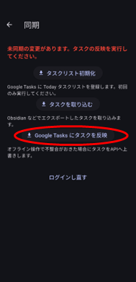
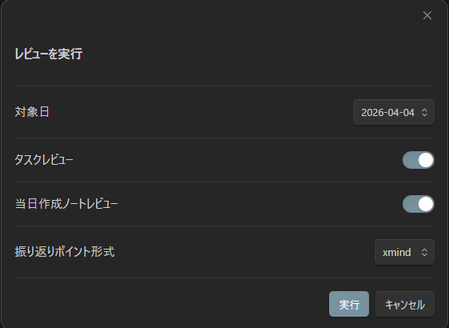

## ⑤ 夜: 振り返り

夜は、その日の実績と記録ノートを確認して、**ユーザ自身が1日を振り返る時間** です。

`ptune-task: 今日の振り返り` を実行すると、デイリーノートにレポートが出力されます。  
AI は要約や整理を補助しますが、内容の判断と明日の計画はユーザが行います。

## 1. ptune の実績を Google Tasks に反映する

1. ptune の同期画面を開く
2. `Google Tasks にタスクを反映` を実行する

これで、その日の完了状態や実績時間が Google Tasks に反映されます。

## 2. 今日の振り返りを実行する

1. Obsidian から、 Ctrl+P でコマンドパレットを開く
2. `ptune-task: 今日の振り返り` を実行する
3. 振り返り設定モーダルを確認して、`実行` をクリックする

モーダルでは、次の項目を確認できます。

- `対象日`
  振り返りを出力する日付です。通常はその日のままで問題ありません。
- `タスクレビュー`
  ptune / Google Tasks の実績をもとに、タスク側の振り返りを出力します。
- `当日作成ノートレビュー`
  その日に作成したノートを集めて、デイリーレポートと振り返りポイントの材料を出力します。
- `振り返りポイント形式`
  `outline` または `xmind` を選びます。通常は既定のままで進めて問題ありません。

## 3. レポートの見方

実行すると、デイリーノートに以下のレポートが出力されます。

| 見出し | 内容 | 確認のポイント |
| --- | --- | --- |
| **`タイムログ／メモ`** |  |  |
| 　　`タイムテーブル` | タスクの実行時間実績レポート | 時間の使い方や切り替わり方を見ます。 |
| 　　`時間分析` | タグごとの時間配分レポート | 実装、調査、設計などの偏りを見ます。 |
| 　　`日次傾向` | 日別の時間推移レポート | 普段より進んだか、停滞したかを見ます。 |
| **`振り返りメモ`** |  |  |
| 　　`デイリーレポート` | 当日作成した作業ノートの一覧 | どのノートで何を進めたかを把握します。 |
| 　　`振り返りポイント` | ユーザ自身が編集する欄 | 良かった点、問題点、明日の Todo を整理します。 |

## 4. 振り返りポイントを編集する

`振り返りポイント` の箇条書きを見ながら、次の手順で整理します。

1. 重複している項目をまとめる
2. 良かった点を残す
3. 問題だった点を追記する
4. 明日やることを Todo として追加する
5. 必要なら粒度や表現を自分で整える

AI が補助した内容は、そのまま採用するのではなく、必ず自分で読み直して調整してください。

## 5. 明日の計画につなげる

最後に、振り返りで出た Todo を翌朝の予定タスクへつなげます。

- 未完了タスクを確認する
- 明日やることを整理する
- 必要なら朝のデイリーノートに移す

これで、1日の振り返りから次の日の計画へ自然につなげられます。
