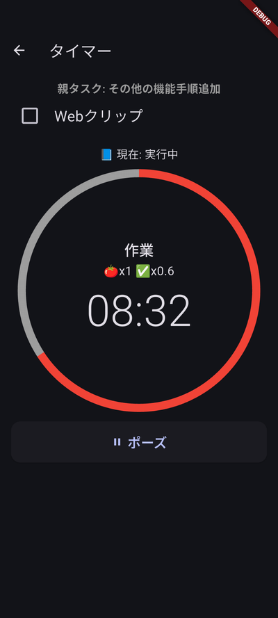
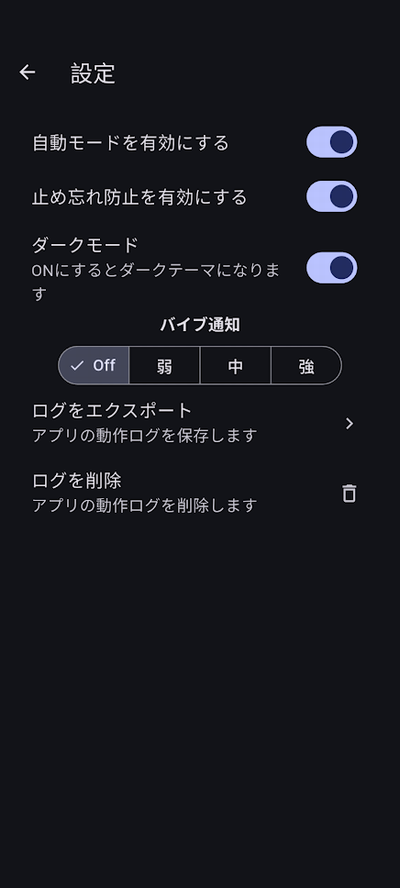

# スマホアプリ **ptune** ガイド

本アプリ **ptune** は、スマホでタスク管理と作業時間の記録を行うための  
ポモドーロタイマー付きタスク管理アプリです。

開発リポジトリ（ソースコードはこちら）  
➡ https://github.com/getperf/ptune

より詳しい画面説明・使い方はこのページで紹介します。

---

## ホーム画面

ホーム画面では、**今日のタスク確認** と **タイマーによる作業開始** を行います。  
🍅 は予定ポモドーロ数、✅ は実績ポモドーロ数を意味します。

### 1. タスク追加（画面右上の + ボタン）
新しいタスクを追加します。

### 2. 今日のタスク概要
予定ポモドーロ（🍅）、実績（✅）、累計時間が表示されます。

### 3. タブ切り替え（未完了 / 完了）
表示するタスクを切り替えます。

### 4. タスクの完了チェック
左側のチェックボックスでタスクを完了としてマークできます。

### 5. タスク名（タップで編集）
タスクの詳細編集画面を開きます。

### 6. タイマーボタン（▶）
このタスクで作業を開始します。タイマー画面へ移動します。

---

## タイマー画面

### 1. タスク完了チェックボックス  
- 作業が完全に終わったときに ON にします。  
- 完了するとタイトルがホーム画面に戻るのリンクになります。

### 2. 円形タイマー（残り時間）  
- ポモドーロの残り時間が可視化され、進行に応じて色が変わります。  
- 今の作業ステータスを表示します。
- 🍅（予定回数）と ✅（実績回数）が表示されます。

### 3. 操作ボタン（ポーズ / 再開 / リセット）  
- `ポーズ`: タイマーを一時停止  
- `再開`: 停止状態から再開  
- `リセット`: 一時停止中に表示され、作業時間を 0 に戻します

---

## 同期画面（Google Tasks）

### 1. タスクリスト初期化（初回のみ）  
Google Tasks に “Today” リストを作成します。最初の一度だけ実行します。

### 2. タスクを取り込む（Google → ptune）   
Google Tasks 側で編集した内容を ptune に読み込みます。

### 3. Google Tasks に反映（ptune → Google）   
ptune 内の変更を Google Tasks に送信します。

### 4. ログインしなおす  
認証エラー時、または Google アカウントを切り替えたい場合に使用します。

> 上部の赤い警告  
> → ptune 内の変更が Google に送られていない場合に表示されます。

---

### 以下の朝と夜に同期を行います

- **朝**：Obsidian でタスク編集 →  
  ptune で **2.「タスクを取り込む」** を実行

- **昼**：ptune で作業ログを記録（ホーム画面 ←→タイマー画面）

- **夜**：作業終了後 →  
  ptune で **3.「Google Tasks に反映」** を実行 →  
  Obsidian で振り返りレポート作成

---

## Google 認証画面

Google Tasks と同期するためのログイン状態を確認・操作する画面です。

### 1. サインアウト  
現在の Google アカウントからログアウトします。  
アカウントを切り替えたいときに使用します。

### 2. 再認証  
アクセストークンが期限切れになった場合や、  
同期エラーが出た場合に使用します。  
ブラウザを開き、再度 Google ログインを行います。

> ※ サインアウトすると同期が行えなくなります。  
> 必要に応じて再認証を行ってください。

---

## 設定画面

アプリの動作・外観・ログ管理を行う画面です。

### 1. 自動モードを有効にする  
作業フェーズ（作業 → 休憩 → 次の作業）を自動で切り替えます。  
ポモドーロを連続で進めたい場合に便利です。

### 2. 止め忘れ防止を有効にする  
一定時間操作がない場合にタイマーを自動停止します。  
タイマーの付けっぱなし防止に使います。

### 3. テーマ切り替え（ライト / ダーク）  
アプリの外観テーマを変更します。  
ダークモードは夜間や長時間の利用に向いています。

### 4. アプリログをエクスポート  
アプリ内部の動作ログをファイルとして保存します。  
不具合の調査や開発者への報告に利用できます。

### 5. アプリログを削除  
保存されているログファイルを削除します。

> ※ログには作業内容は含まれず、アプリの動作情報のみが記録されます。

---

## 連携について

- Obsidian プラグイン **ptune-log** と連携することで  
  1 日の作業ログが Daily Note にまとめられます  
- Windows の場合、認証を簡素化する補助アプリ **PtuneSync** を利用

より詳しい連携説明：  
➡ /ptune-log/

---

